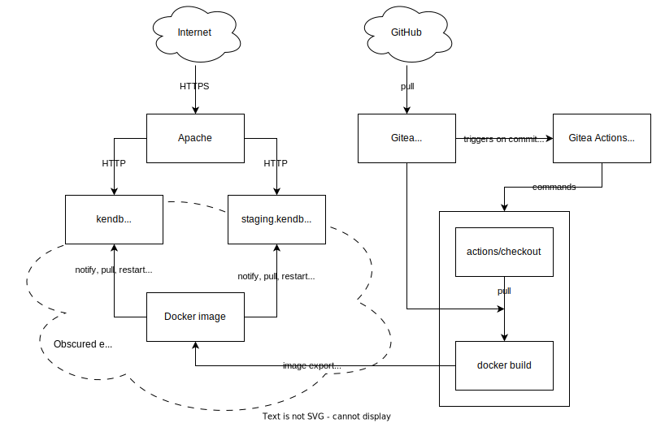

# Deploying KenDB3

## Overview



Feel free to ask OLEGSHA personally about the details of "Obscured environment" if you're interested.

## Prerequisites

The repository is mostly self-contained. The following is required to deploy the website:
- install Python and NPM dependencies
- provide a Django secret key using environment variables `SECRET_KEY_FILE` or `SECRET_KEY` (Django secret key can be any string)
- set `DEBUG` environment variable to `False` to enable production mode in Django
- set `ALLOWED_HOSTS` environment variable to the fully qualified domain name to expect in HTTP Host header

After that, the webserver can be started:
```bash
# In repository root
gunicorn kendb3.wsgi
```

## Docker

The repository contains a Dockerfile that can be used to build an almost-ready-to-deploy image.

```bash
# In repository root
docker build --tag kendb3:latest
docker run \
    --publish=80:80 \
    --volume=./db.sqlite3:/usr/src/app/db.sqlite3 \
    --volume=./django_secret_key:/django_secret_key \
    --env=SECRET_KEY_FILE=/django_secret_key \
    --env=ALLOWED_HOSTS=kendb3.example.com \
    kendb3:latest
```

## Gitea Actions

The repository additionally contains a CI configuration for automatic deployment at windcorp.ru by means of [Gitea Actions](https://docs.gitea.com/usage/actions/overview) (very similar to [GitHub Actions](https://github.com/features/actions)).

The action checks out the repository into a container, then builds the Docker image and tags it appropriately. Finally, the host is notified through a method I will not disclose, and the running instance is reloaded based on the image that was built.

The infrastructure on host is not represented in this repository.
